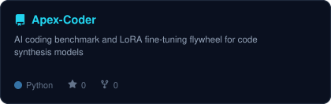
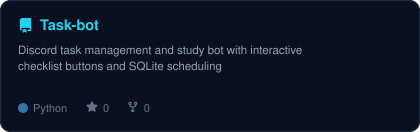

<!-- BANNER - Terminal Profile Banner (Dual-Phase SMIL SVG) -->
<picture>
  <source media="(prefers-color-scheme: dark)" srcset="assets/dark.svg" />
  <source media="(prefers-color-scheme: light)" srcset="assets/light.svg" />
  
</picture>

 

<!-- DYNAMIC TYPING TAGLINE -->

 

<!-- SOCIAL BADGES & LIVE PROFILE VIEWS -->

&nbsp;&nbsp;

 
 

---

## This is me :)

Hi, I'm **Shivang Soni**, a Data Science student and Machine Learning enthusiast based in Bhopal, India 🇮🇳.  
I spend my time exploring neural architectures, fine-tuning models, and building software that bridges analytical algorithms with real-world utility.

- 🎓 **Education:** Pursuing a **BS in Data Science & Applications** from **IIT Madras**.
- 🤖 **AI & Deep Learning:** Focused on PyTorch, neural networks, model fine-tuning (LoRA), and automated evaluation flywheels.
- 🛠️ **Full-Stack & Systems:** Combining analytical Python backends with modern developer stacks (React, PostgreSQL, Docker).
- ⚡ **Current Focus:** Autonomous agent workflows, developer productivity bots, and high-performance ML pipelines.
- 💬 **Let's Connect:** Open to research discussions, open-source collaboration, and data-driven engineering projects.

---

## My Stack

---

## Signals

<table>
<tr>
<td width="50%" align="center" valign="middle">

<!-- Skill Radar - edit assets/skills.json to redraw -->
<picture>
  <source media="(prefers-color-scheme: dark)" srcset="assets/radar-dark.svg">
  <source media="(prefers-color-scheme: light)" srcset="assets/radar-light.svg">
  
</picture>

</td>
<td width="50%" align="center" valign="middle">

<!-- Language & Stack Radar - edit assets/langmix.json to redraw -->
<picture>
  <source media="(prefers-color-scheme: dark)" srcset="assets/radar-langs-dark.svg">
  <source media="(prefers-color-scheme: light)" srcset="assets/radar-langs-light.svg">
  
</picture>

</td>
</tr>
</table>

---

## Featured Projects

<table>
<tr>
<td width="50%" align="center" valign="middle">

<a href="https://github.com/Shivxng3010/Apex-Coder">
  <picture>
    <source media="(prefers-color-scheme: dark)" srcset="assets/card-Apex-Coder-dark.svg">
    <source media="(prefers-color-scheme: light)" srcset="assets/card-Apex-Coder-light.svg">
    
  </picture>
</a>

</td>
<td width="50%" align="center" valign="middle">

<a href="https://github.com/Shivxng3010/Task-bot">
  <picture>
    <source media="(prefers-color-scheme: dark)" srcset="assets/card-Task-bot-dark.svg">
    <source media="(prefers-color-scheme: light)" srcset="assets/card-Task-bot-light.svg">
    
  </picture>
</a>

</td>
</tr>
</table>

---

## Numbers Matter

 

 
 

<picture>
  <source media="(prefers-color-scheme: dark)" srcset="https://raw.githubusercontent.com/Shivxng3010/Shivxng3010/output/github-snake-dark.svg" />
  <source media="(prefers-color-scheme: light)" srcset="https://raw.githubusercontent.com/Shivxng3010/Shivxng3010/output/github-snake.svg" />
  
</picture>

 
 

` Built with care · @Shivxng3010 `

